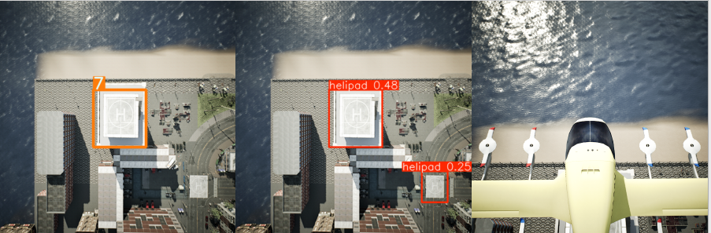

# 🛩️ UE5 AirTaxi Simulator
### *A Photo Realistic UE5 Simulator for UAVs*

<table>
  <tr>
    <td>
      
      <p align="center">Landing in Carla UE5</p>
    </td>
  </tr>
</table>

---
## 📌 Overview

This repository extends **[AirTaxiSim](https://github.com/CPS-IL/airtaxisim)**, which is based on CARLA UE4. In this work, the simulator is updated to **CARLA UE5**.


## 🛠️ System Requirements

| Component | Requirement |
|---------|------------|
| OS | Ubuntu **20.04.6 LTS** or **22.04.4 LTS** |
| GPU | NVIDIA GPU (RTX series recommended) |
| Compute | CUDA support required |
| Software   | Docker + NVIDIA Container Toolkit |
| Disk Space | 100 GB                            |

> 📄 Detailed installation guide:  
> **[Docker Installation on Linux](https://docs.docker.com/engine/install/ubuntu/)**

> **[NVIDIA Container Toolkit Installation](https://docs.nvidia.com/datacenter/cloud-native/container-toolkit/latest/install-guide.html)**


> Python packages: 
```bash
python3 -m pip install loguru
```

## Quick Start
### Clone this repository with submodules.

```bash
git clone -b ue5_simulator --single-branch --recurse-submodules https://github.com/ashikrasul/TTU_vtol.git
cd ttu_vtol

#If you already cloned without submodules: 
git submodule update --init --recursive
```
### Docker Sudo access and Host Diplay Access: 
```
sudo chmod 666 /var/run/docker.sock
xhost +local:docker
```
### Build the containers and Run the simulator: 
``` 
python3 rraaa.py configs/single-static.yml
```

## 📖 Citation

If you use this simulator in your research, please cite:

```bibtex
@article{rasul2025development,
  title   = {Development and Testing for Perception Based Autonomous Landing of a Long-Range QuadPlane},
  author  = {Rasul, Ashik E and Tasnim, Humaira and Kim, Ji Yu and Lim, Young Hyun and Schmitz, Scott and Jo, Bruce W and Yoon, Hyung-Jin},
  journal = {arXiv preprint arXiv:2512.09343},
  year    = {2025}
}
```

## Contact
  - [Ashik E Rasul](mailto:ashik.rasul@outlook.edu)
  - [Hyung-Jin Yoon](mailto:stargaze221@gmail.com)


This repository contrains the cad files and images from fixed-wing to QuadPlane conversion. 

The main airframe is 2.4m wingspan Voluntex Ranger 2400. We redesigned the avitionis, wings, propeller mountings to accomodate sensors for perception and edge device such as NVIDIA jetson orin nano to process machine learning models. 

The work is going to be published at AIAA SchiTech 2026. 

Details is coming soon...
