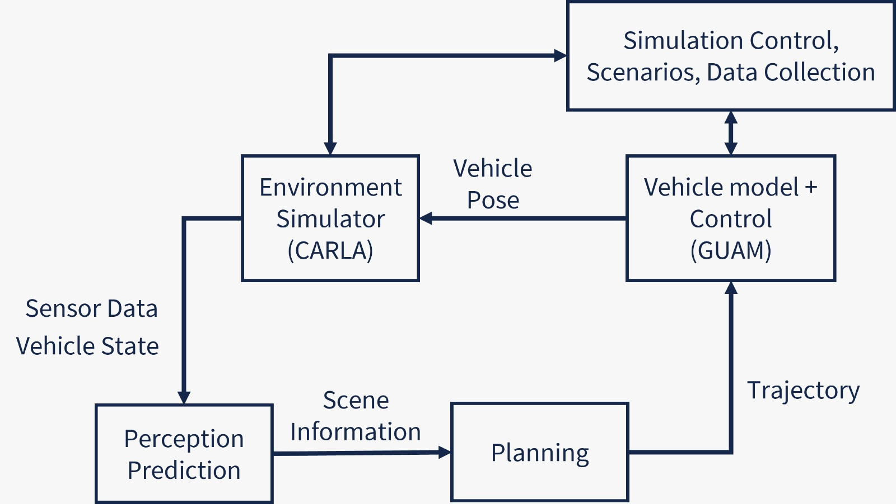
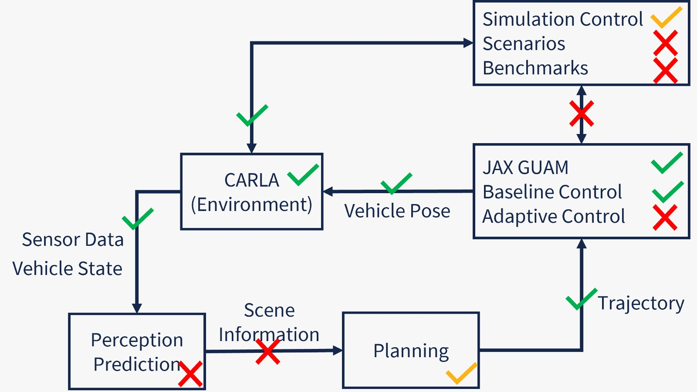

# RRAAA-Sim
### Robust and Resilient Autonomy for Advanced Air Mobility

This repository is a work-in-progress SITL simulator for autonomous air taxis.

<table>
  <tr>
    <td>
      
      <p align="center">Functional Diagram</p>
    </td>
    <td>
      
      <p align="center">Current State</p>
    </td>
  </tr>
</table>


### Prereqs

- Ubuntu 20.04.6 LTS or 22.04.4 LTS (Other versions untested, but should work.)
- CUDA GPU for Pytorch and Unreal Engine, e.g., NVIDIA GeForce RTX series.
- Install Docker and Nvidia Docker Toolkit, see [doc/tools_installation.md](doc/tools_installation.md) for detailed instructions.
- Python packages
```bash
python3 -m pip install loguru
```

### Quick Start
Clone this repository with submodules.

```bash
git clone https://github.com/CPS-IL/rraaa-sim.git --recurse-submodules
cd rraaa-sim
git switch ashikrasul
git submodule update --init --recursive
#docker sudo access:
sudo chmod 666 /var/run/docker.sock
#docker access to host display
xhost +local:docker

#update google map Api Key 
cd helipad_detection
echo -n "api_key" > api.csv
#generate the dataset for training
python3 csv_to_meta.py

==> copy the absolute path of dataset folder inside data/subset_5.yml, replace the data: field

cd rraaa-sim 

#run the bayesian optimization loop along with training & simulation

python3 train_simulate_optimize.py


python3 rraaa.py configs/single-static.yml
```


### Contact
  - [Hyung-Jin Yoon](mailto:stargaze221@gmail.com)
  - [Ayoosh Bansal](mailto:ayooshb2@illinois.edu)
  - [Mikael Yeghiazaryan](mailto:myeghiaz@illinois.edu)
  - [Oswin So](mailto:oswinso@mit.edu) : JAX GUAM

