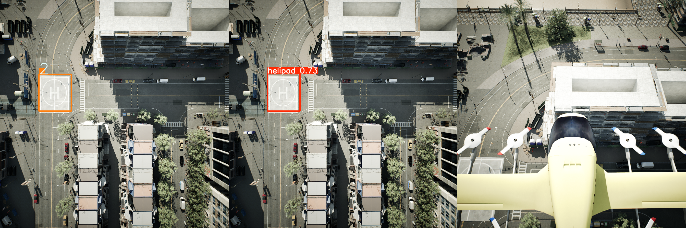

# 🛩️ UE5 AirTaxi Simulator — Bayesian Training Branch
### *Iterative Training of Landing Pad Detector using Bayesian Optimization*

<table>
  <tr>
    <td>
      
      <p align="center">Landing in Carla UE5</p>
    </td>
  </tr>
</table>

---
## 📌 Overview

This branch (`bayes_training`) extends the UE5 AirTaxi Simulator with a **Bayesian Optimization pipeline** for iterative training of the landing pad detector.

The optimizer runs closed-loop experiments inside the CARLA simulator (UE4 or UE5) and intelligently selects the next training configuration to maximize detection performance.


## 🛠️ System Requirements

| Component | Requirement |
|---------|------------|
| OS | Ubuntu **20.04.6 LTS** or **22.04.4 LTS** |
| GPU | NVIDIA GPU (RTX series recommended) |
| Compute | CUDA support required |
| Software   | Docker + NVIDIA Container Toolkit |
| Disk Space | 100 GB                            |

> 📄 Detailed installation guide:  
> **[Docker Installation on Linux](https://docs.docker.com/engine/install/ubuntu/)**

> **[NVIDIA Container Toolkit Installation](https://docs.nvidia.com/datacenter/cloud-native/container-toolkit/latest/install-guide.html)**


> Python packages: 
```bash
python3 -m pip install loguru
```

## Quick Start
### Clone this repository with submodules.

```bash
git clone -b bayes_training --single-branch --recurse-submodules https://github.com/ashikrasul/TTU_vtol.git
cd TTU_vtol

#If you already cloned without submodules:
git submodule update --init --recursive
```
### Docker Sudo access and Host Display Access:
```bash
sudo chmod 666 /var/run/docker.sock
xhost +local:docker
```
### Run Bayesian Training with default parameters (UE5):
```bash
python3 bo_optimize.py
```

### Run with UE4:
Edit `configs/single-static.yml`:
```yaml
env_sim_key: env_sim_ue4
carla_key:   carla_ue4
```
Then run:
```bash
python3 bo_optimize.py
```

### Run the simulator standalone:
```bash
python3 rraaa.py configs/single-static.yml
```


> 📄 YOLO model deployment on Jetson:  
> **[Jetson Deployment Guide](https://docs.ultralytics.com/guides/nvidia-jetson/#what-is-nvidia-jetson)**


## 📖 Citation

If you use this simulator in your research, please cite:

```bibtex
@article{rasul2025development,
  title   = {Development and Testing for Perception Based Autonomous Landing of a Long-Range QuadPlane},
  author  = {Rasul, Ashik E and Tasnim, Humaira and Kim, Ji Yu and Lim, Young Hyun and Schmitz, Scott and Jo, Bruce W and Yoon, Hyung-Jin},
  journal = {arXiv preprint arXiv:2512.09343},
  year    = {2025}
}
```

## Contact
  - [Ashik E Rasul](mailto:ashik.rasul@outlook.edu)
  - [Hyung-Jin Yoon](mailto:stargaze221@gmail.com)


